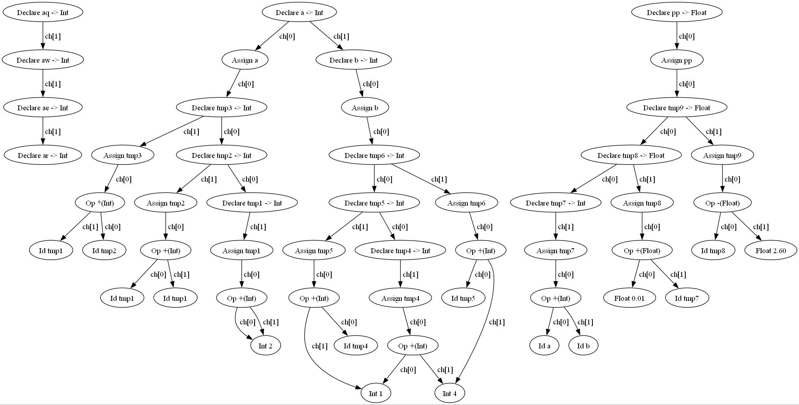

# tiny_compiler_plus
**Based on tiny, several improvements have been applied**

## Highlights

### 1. Addition of floating point operations
### 2. Addition of XOR operation (useful for replacing boolean operations with integer operations in logical operations, which makes it logically complete)
### 3. Implementation of '>=' and '<=' in analysis and assembly code generation (already implemented in the virtual machine)
### 4. Direct use of integers in if condition judgments (actually, no extra implementation is needed, just remove the check for boolean types in syntax checking)
### 5. Addition of type declarations, which can only be used after declaration. (But it is not actually implemented at the bottom layer, because strong typing requires additional type annotation for each address, which is a large workload)
### 6. Assign initial values when defining, and report errors for repeated definitions
### 7. Incorporate DAG optimization, merging the same variable components within the same expression.

### 8. Based on step 7, use temporary variables for storage to optimize the underlying code generation.

### 9. Stronger type checking at declaration (However, type checking can only be done on constants, not on variables in expressions, because types are not marked in the symbol table)

## Usage

**In 'TC' folder**

```
g++ *.c -o tiny -w
./tiny *.tny
cp *.tm ../TM
```
At the same time, you can also use
```
dot -Tjpg syntax_tree.dot -o syntax_tree.jpg
```
to generate a visualization of the syntax tree.

tip: makefile exists unknown problem, it's not usable for now(or you can commit to fix this problem).

**In 'TM' folder**

```
g++ tm.c -o tm -w
./tm *.tm
```