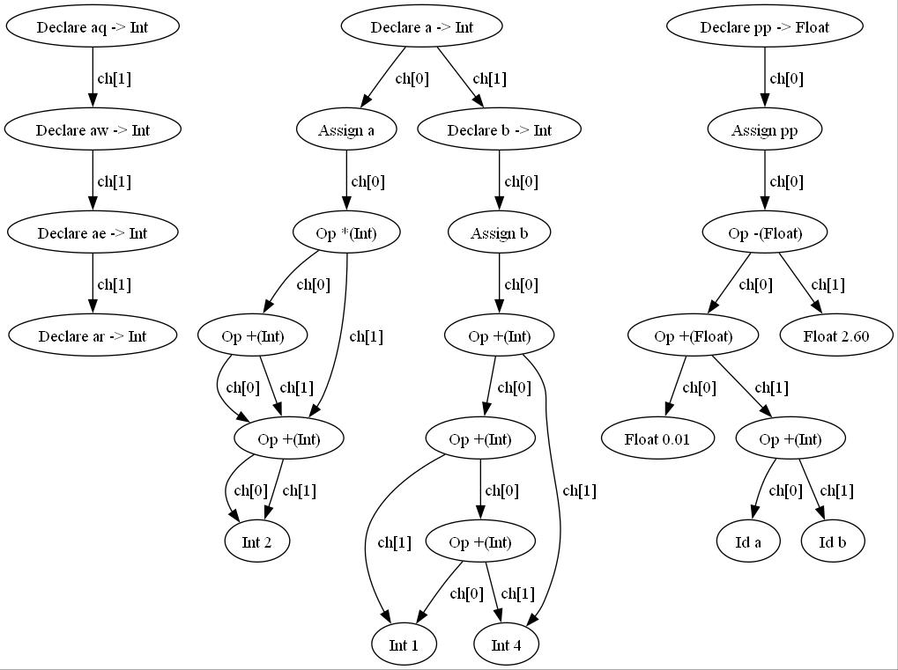

# 改进版tiny编译器
**在tiny基础上增加一些新的特点**

## 亮点

### 1. 添加浮点数的运算
### 2. 添加异或运算（便于在逻辑运算中用整数运算替代布尔运算，这样才能逻辑完备）
### 3. 将>=和<=在分析、汇编码生成中实现（虚拟机中已经实现）
### 4. 在if条件判断中直接用整数进行（其实不用额外实现，在语法检查中删除掉对布尔类型的检查即可）
### 5. 添加类型声明，且在声明后才能使用。（但没有在底层实际实现，因为强类型需要额外对每个地址标注类型，工作量较大）
### 6. 定义时赋初值、重复定义报错
### 7. 加入DAG优化，在同一个表达式内部进行相同变量成分的合并。（可选项，在main.c中可以选择关闭）


## 用法

**在 'TC' 文件夹中**

```
g++ *.c -o tiny -w
./tiny *.tny
cp *.tm ../TM
```

注意: makefile 存在一些问题，暂时不可用（也许你也可以帮助我一起修复它）。

**在 'TM' 文件夹中**

```
g++ tm.c -o tm -w
./tm *.tm
```