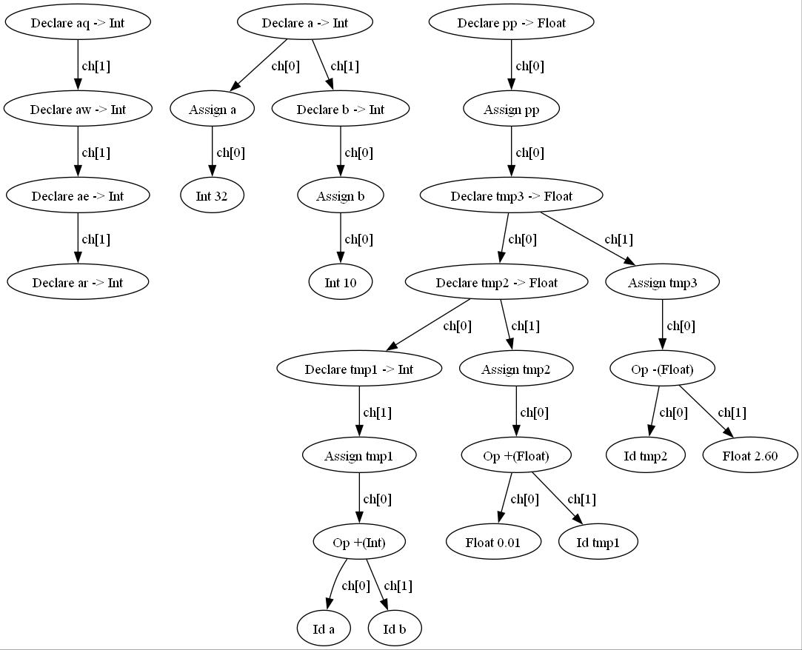

# 改进版tiny编译器
**在tiny基础上增加一些新的特点**

## 亮点

### 1. 添加浮点数的运算
### 2. 添加异或运算（便于在逻辑运算中用整数运算替代布尔运算，这样才能逻辑完备）
### 3. 将>=和<=在分析、汇编码生成中实现（虚拟机中已经实现）
### 4. 在if条件判断中直接用整数进行
### 5. 添加类型声明，且在声明后才能使用。（但没有在底层实际实现，因为强类型需要额外对每个地址标注类型，工作量较大）
### 6. 定义时赋初值、重复定义报错
### 7. 加入DAG优化，在同一个表达式内部进行相同变量成分的合并。

### 8. 在7的基础上使用临时变量进行保存，在底层代码生成中做到优化。

### 9. 在声明时更强的类型检查（但是只能做到常数上的类型检查，不能对表达式中变量进行判断，因为在符号表中没有标注类型）
### 10. 添加常量合并


## 用法

**在 'TC' 文件夹中**

```
make
```
windows
```
tiny x.tny
copy x.tm ../TM
```
mac/linux
```
./tiny x.tny
cp x.tm ../TM
```
即可生成tiny的可执行文件，并编译.tny文件生成.tm文件拷贝到/TM中

同时，也可以使用
```
dot -Tjpg syntax_tree.dot -o syntax_tree.jpg
```
生成符号树的可视化图。

**在 'TM' 文件夹中**

```
g++ tm.c -o tm -w
```
windows
```
tm x.tm
```
mac/linux
```
./tm x.tm
```